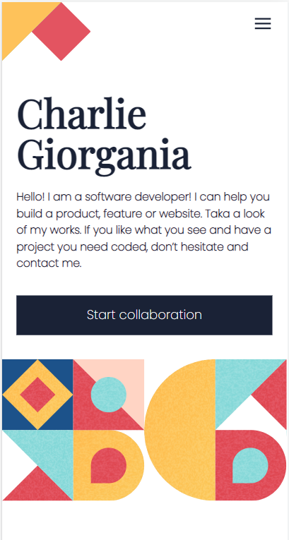

# Project Name

> One paragraph statement about the project.

Additional description about the project and its features.

## Built With

- HTML
- CSS

## Live Demo

[Live Demo Link](https://livedemo.com)

## Getting Started

To get a local copy up and running follow these simple example steps.

### Prerequisites

### Setup

### Install

### Usage

### Deployment

## Authors

👤 **Mahmoud Rizk**

- GitHub: [@Elerqsousy](https://github.com/Elerqsousy)
- LinkedIn: [Mahmoud El Erqsousy](https://www.linkedin.com/in/mahmoud-rizk/)

## 🤝 Contributing

Contributions, issues, and feature requests are welcome!

## Show your support

Give a ⭐️ if you like this project!

## 📝 License

This project is [MIT](./MIT.md) licensed.
